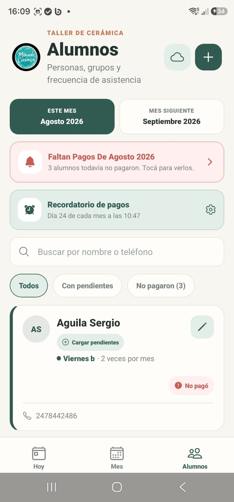
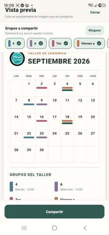

# Taller de Cerámica

Aplicación móvil desarrollada para gestionar la operación cotidiana de un taller de cerámica: alumnos, grupos, clases, asistencias, recuperaciones, pagos, vacantes, modelos y preparación de materiales.

## Capturas

<p align="center">
  
  
  
</p>

<p align="center">
  
  
</p>

## Sobre el proyecto

La aplicación busca reemplazar agendas, anotaciones y controles separados por una herramienta móvil centralizada para administrar el taller.

Permite saber rápidamente quién viene a cada clase, qué lugares están disponibles, cuántas clases pendientes tiene cada alumno, quién todavía no pagó y qué modelos, moldes o materiales deben prepararse. Toda la información se guarda localmente en el dispositivo, sin depender de un backend para el funcionamiento cotidiano.

## Funcionalidades principales

- Gestión de alumnos, teléfonos, grupos y cambios permanentes de grupo.
- Grupos configurables por día, horario, capacidad y frecuencia semanal o de dos clases por mes.
- Generación y mantenimiento automático de la agenda recurrente desde una fecha inicial.
- Agenda general con próximas clases, asistencia y accesos rápidos a pendientes y vacantes.
- Cálculo de cupos estructurales y lugares liberados por ausencias, con avisos de vacantes para compartir.
- Registro y reversión de ausencias con un libro de movimientos para clases pendientes.
- Recuperaciones de clases habituales y de clases extra, con consumo y devolución segura del saldo.
- Cambios individuales de la próxima clase para ocupar otro lugar disponible.
- Clases extra pagadas, a favor o pendientes de cobro.
- Traslado de grupos completos por feriados o compromisos, con posibilidad de deshacer el cambio.
- Reajuste del patrón futuro de grupos de dos clases por mes, con historial y restauración.
- Seguimiento mensual de pagos, cantidad de clases abonadas y extras compradas, usadas o adeudadas.
- Filtros de alumnos con pendientes o pagos faltantes y recordatorios mensuales configurables.
- Calendario mensual con grupos, asistencias, movimientos y vacantes visibles por fecha.
- Vista previa del calendario para elegir grupos y compartir una imagen.
- Catálogo editable de modelos con tipo de arcilla, descripción y fotografías.
- Asignación de uno o varios modelos y materiales a cada persona y clase.
- Reutilización de pedidos de una clase ausente en un recuperatorio o en la próxima clase habitual.
- Notificaciones locales para preparar clases, cobrar pagos y recordar copias de seguridad.
- Copias de seguridad versionadas en JSON, restauración validada y opción de deshacer mediante una copia de emergencia.
- Persistencia local con SQLite y migraciones compatibles con datos de versiones anteriores.

## Tecnologías

- React 19 y React Native 0.81.
- Expo SDK 54 y Expo Router 6.
- TypeScript 5.9.
- SQLite mediante `expo-sqlite`.
- Notificaciones locales mediante `expo-notifications`.
- `expo-file-system`, `expo-document-picker` y `expo-sharing` para respaldos y archivos compartidos.
- `expo-image-picker` para las fotografías del catálogo de modelos.
- `react-native-view-shot` para generar la imagen del calendario compartible.
- Expo EAS y scripts de PowerShell para compilaciones Android.

## Arquitectura

El proyecto separa la interfaz, las reglas de negocio y el acceso a datos:

- `app/`: pantallas y navegación basada en Expo Router.
- `components/`: modales, controles y componentes visuales reutilizables.
- `models/`: tipos y entidades del dominio.
- `repositories/`: operaciones de lectura y escritura para agenda, alumnos, grupos, pagos y demás entidades.
- `database/`: conexión SQLite, esquema, índices, migraciones y mantenimiento de la agenda.
- `lib/`: reglas de negocio y servicios para pagos, vacantes, notificaciones, calendario y copias de seguridad.

Las pantallas y los componentes no realizan consultas SQL directamente. `lib/db.ts` se conserva como fachada de compatibilidad y delega el acceso real en `database/` y `repositories/`.

## Decisiones técnicas

- Funcionamiento local y sin backend para que la gestión diaria no dependa de conectividad.
- SQLite como fuente persistente para relaciones entre alumnos, grupos, agenda, pagos y modelos.
- Operaciones críticas ejecutadas en transacciones para mantener sincronizados asistencia, cupos y saldos pendientes.
- Migraciones idempotentes e índices para mantener compatibilidad y rendimiento al evolucionar el esquema.
- Libro de movimientos para auditar ausencias, recuperaciones, ajustes manuales y reversiones.
- Agenda recurrente que diferencia clases habituales, recuperaciones, extras y movimientos excepcionales.
- Historial específico para reajustes de grupos y reversión segura de cambios.
- Respaldos con formato versionado, validación previa y copia de emergencia antes de restaurar.
- Notificaciones reconstruidas desde los datos locales, incluyendo personas y modelos de cada clase.

## Instalación y desarrollo

```powershell
npm install
npx expo start
```

Para generar y ejecutar el proyecto nativo en Android:

```powershell
npm run android
```

Comandos de validación disponibles:

```powershell
npm test
npm run typecheck
npm run lint
```

## Android

APK instalable mediante Expo EAS:

```powershell
npm run build:apk
```

Android App Bundle mediante Expo EAS:

```powershell
npm run build:aab
```

AAB firmado mediante el entorno Android local:

```powershell
npm run build:aab:local
```

La configuración de compilación está en `eas.json`. Los textos, declaraciones, política y recursos gráficos para Google Play se encuentran en `docs/google-play/` y `play-store/`.

## Estado del proyecto

Proyecto funcional en desarrollo continuo, orientado a Android y preparado para distribución mediante Expo EAS y Google Play.
